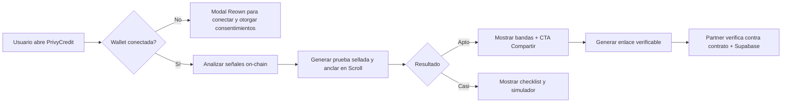
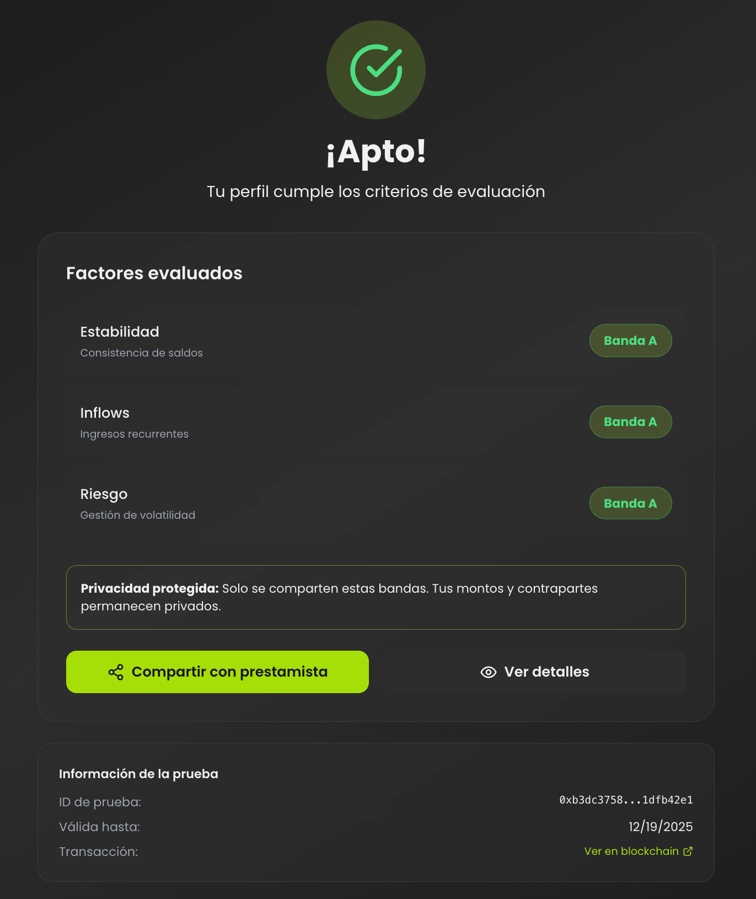

# PrivyCredit

PrivyCredit es la puerta de entrada para ofrecer crédito confiable sobre señales on-chain. Permitimos que los usuarios prueben su solvencia sin entregar datos sensibles y brindamos a los partners un flujo claro, medible y con identidad propia.

## Propuesta
- **Confianza inmediata:** pruebas selladas que se anclan en Scroll, listas para que bancos y fintechs las verifiquen.
- **Experiencia cuidada:** guía paso a paso (conectar, analizar, compartir) que reduce fricción y comunica valor en todo momento.
- **Activación comercial:** módulos de checklist, simulador y recordatorios mantienen al prospecto en tu embudo incluso si aún no califica.
- **Infra lista para alianzas:** Supabase + AppKit + wagmi facilitan integrar wallets, datos y contratos en un mismo stack.

## Flujo Comercial
1. Usuario conecta su wallet y otorga consentimiento para el análisis.
2. El sistema analiza activity on-chain, genera bandas (A/B/C) y sella la prueba.
3. El resultado se presenta con mensajes accionables; si califica puede compartir un enlace verificable con terceros.
4. Lado verificador, se consulta la prueba contra el contrato y la metadata persistida en Supabase.

### Diagrama de Flujo


## Componentes Clave
| Capa | Valor para negocio |
| --- | --- |
| **Experiencia (React + Tailwind)** | UI responsiva lista para campañas, soporta múltiples pantallas y mensajes marketing-ready. |
| **Orquestación Web3 (AppKit + wagmi + viem)** | Conexión segura a wallets Scroll y ejecución de `submitProof` sin exponer lógica sensible. |
| **Datos (Supabase)** | Persistencia de pruebas, mejoras y recordatorios para nutrir CRM y seguimiento. |
| **Blockchain (Scroll Sepolia)** | Registro inmutable que respalda cada prueba con un hash verificable por socios. |

## Lanzamiento Rápido
1. **Requisitos:** Node 20+, npm 10+, wallet compatible con Scroll.
2. **Instalación:** `npm install` y copia `.env.example` a `.env.local` (todas las claves deben iniciar con `VITE_`).
3. **Configura** RPC de Scroll, dirección del contrato y credenciales de Supabase.
4. **Ejecución:** `npm run dev` para la demo interna; `npm run build` + `npm run preview` para QA previo a campañas.

> Nota: Documentos de estrategia (PRD, blockchain, design system) viven en la carpeta `docs/` para alinear marketing, producto y tech.

## Imagen de Referencia
*(Reserva este espacio para un mockup o hero visual del flujo principal.)*

```

```
